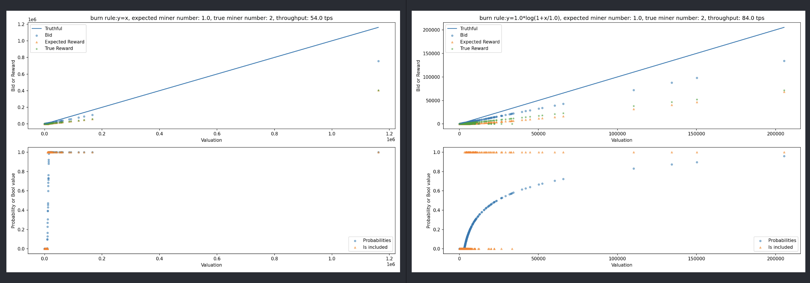

Log-revenue Mechanism: Improving DAG Throughput via Transaction Fee Design
=======

Environment
-----

In our DAG enviroment ([`DAGEnv`](./envs/DAGEnv.py)), episode step is 1, so `done` flag is always True.


Config
-----

Base config is in [`./config/base.yaml`](./config/base.yaml).

Data
-----

Data source: [https://gz.blockchair.com/bitcoin/transactions/](https://gz.blockchair.com/bitcoin/transactions/)

Get fee data:

```bash
python3 ./data/get_fee.py
```

Fee distribution:
mean: 7167.122512974324, std: 38358.98737426391


Run
-----

* Train: train function approximator
* Test: test throughputs
* Eval: evaluate the equilibrium

Example:

```bash
conda env create -f environment.yml
conda activate <env_name>

python3 -u ./run.py \
        --method ES \
        --mode train \
        --cfg ./config/es.yaml \
        --seed 3407\
        --max_agents_num 500\
        --lambd 1 \
        --delta 1 \
        --burn_flag log \
        --b 50 \
        --a 1 \
        --clip_value 100000000 \
        --norm_value 1
```

Result
-----

