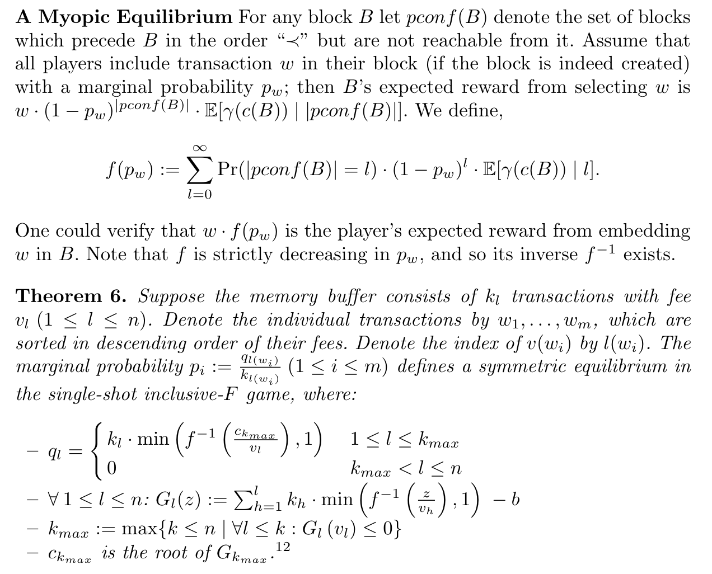
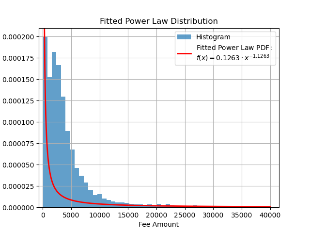

Log-revenue Mechanism: Improving DAG Throughput via Transaction Fee Design
=======

Environment
-----

In our DAG enviroment ([`DAGEnv`](./envs/DAGEnv.py)), episode step is 1, so `done` flag is always True, and $\hat{A}=r-V(s)$.

The DAG environment uses the theorems 6 in _Inclusive Block Chain Protocols_ to calculate the transaction inclusion probability.



Config
-----

Base config is in [`./config/base.yaml`](./config/base.yaml). Part of the config parameters are from _TIPS: Transaction Inclusion Protocol With Signaling in DAG-Based Blockchain_.

Data
-----

Data source: [https://gz.blockchair.com/bitcoin/transactions/](https://gz.blockchair.com/bitcoin/transactions/)

Get fee data:

```bash
python3 ./data/get_fee.py
```

Fee distribution:
mean: 7167.122512974324, std: 38358.98737426391


Run
-----

* Train: train function approximator
* Test: test throughputs
* Eval: evaluate the equilibrium

```bash
# Train Agent
python3 ./run.py --method [DDPG/PPO/NN] --mode train --cfg ./config/[ddpg/ppo/nn].yaml
# i.e. python3 -u ./run.py --method PPO --mode train --cfg ./config/ppo.yaml > ./results/log/ppo.log
# i.e. python3 -u ./run.py --method DDPG --mode train --cfg ./config/ddpg.yaml > ./results/log/ddpg.log
# Test throughputs
python3 ./run.py --method [DDPG/PPO/NN] --mode test --cfg ./config/[ddpg/ppo/nn].yaml
# Eval equilibrium
python3 ./run.py --method [DDPG/PPO/NN] --mode eval --cfg ./config/[ddpg/ppo/nn].yaml
```

Result
-----

| TFM | Throughput | Social Welfare | $\max\{|a_{optimal}-a|\}$ | $\max\{r_optimal-r\}$ |
|:--:|:--:|:--:|:--:|:--:|
| normal | 2.6022 | 21830.8362 | 1222.4826398699383 | 490.99725859408466 |
| $\log(1+x)$ | 2.8716 | 14789.4342 | 367.26538937647535 | 72.50869694291318 |
| pay as bid | | | | |
